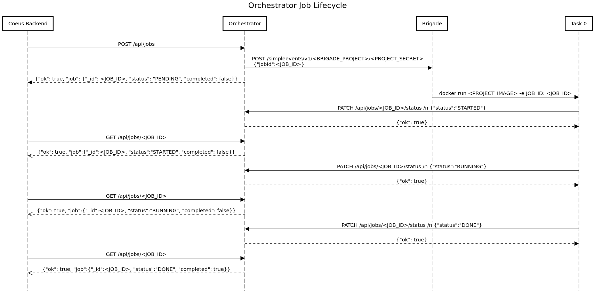

# Orchestrator

The `orchestrator` is a job management system that allows for the asynchrounous execution of `k8s pods` and is comprised of a `go RESTAPI` with a `mongodb` presistence layer along with [brigade](https://brigade.sh) `k8s` deployment. 

## Job lifecycle

 

### Orchestrator RESTAPI

|Method| Endpoint | Description|
|---|---|---|
|`GET`| `/api/jobs` | lists all job in the database |
|`GET`| `/api/jobs/:id`| retrieves a `job` based on its ID |
|`POST`| `/api/jobs` | creates a `job` object and adds it to the database |
|`PATCH` | `/api/jobs/:id` | changes the `Completed` property of a `job` based on its ID |
|`PATCH` | `/api/jobs/:id/brigade` | adds the associated brigade `buildId` & `workerId` from the launched process  |
|`PATCH` | `/api/jobs/:id/status` | changes the job status to one of ['PENDING','STARTED','RUNNING','DONE','ERRORED'] |
|`DELETE` | `/api/jobs/:id` | deletes a `job` based on its ID |

## 🚀 Launch Minikube / Orchestrator

```bash
# install helm dependencies 
make install-deps

# spin up minikube, 
make start

# ensure services was deployed
watch kubectl get all

# launch the kashti brigade dashboard
make kashti
```